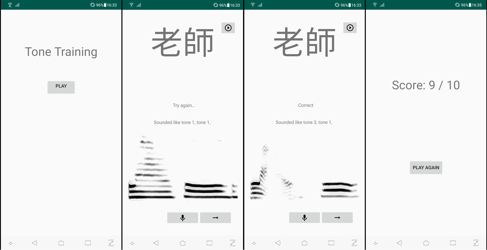

# Tone-Recognition-Application

An Android application for second language Mandarin learners. This app helps users practice and memorize Mandarin tone pronunciation. Users attempt to pronunounce the word on screen, and the app judges their tone pronunciation. Users can also see the spectrogram of their recorded attempt on screen.

The tone recognition model was developed here: [Mandarin Tone Recognition model](https://github.com/claw89/Mandarin-Tone-Recognition); this model takes the spectrogram of a user's pronunciation attempt as its input and combines a convolutional neural network and a recurrent neural network for tone prediction.

