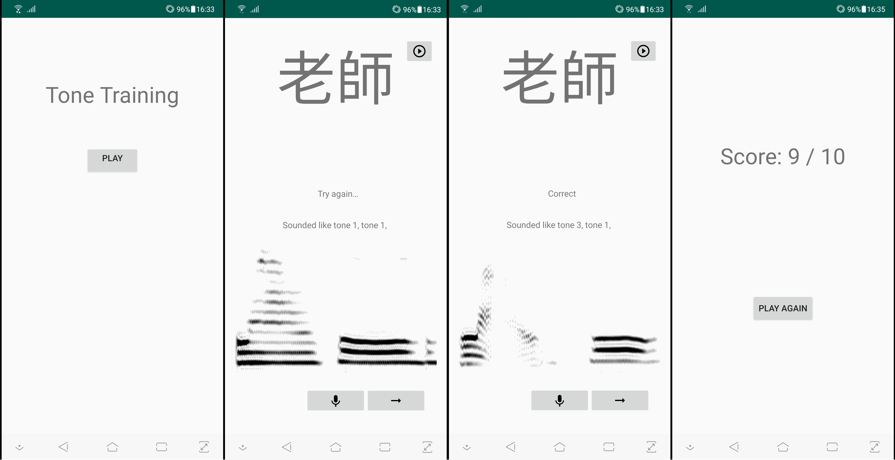

# Tone-Recognition-Application

An Android application demonstrating the use of this [Mandarin Tone Recognition model](https://github.com/claw89/Mandarin-Tone-Recognition) for second language Mandarin learners.

